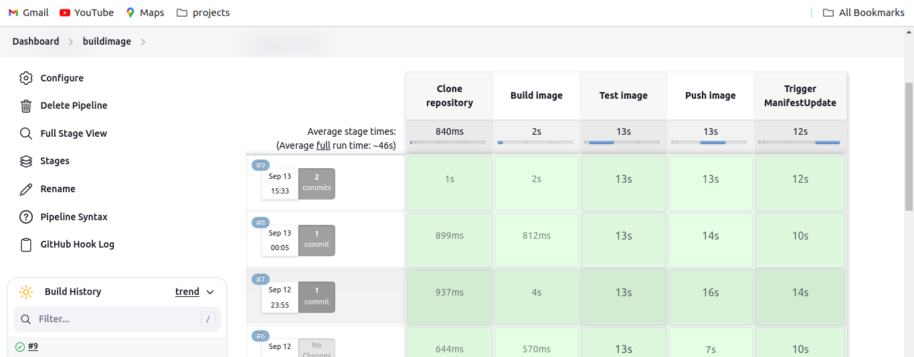
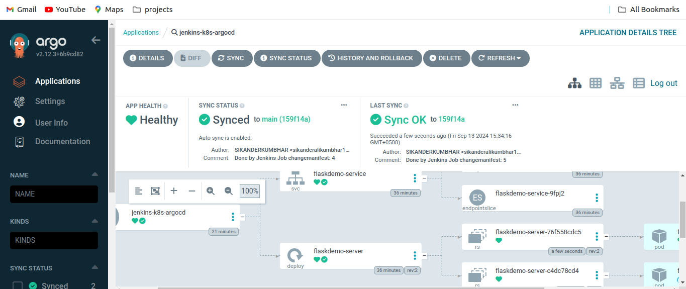
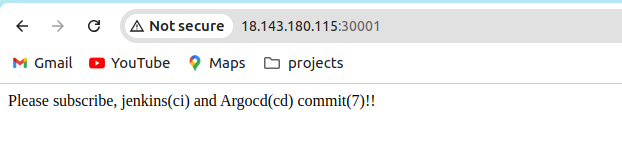

---

# Continuous Integration and Continuous Deployment (CICD) Project with Jenkins and ArgoCD on Kubernetes

## Overview
This project demonstrates a complete CI/CD pipeline, integrating Jenkins for Continuous Integration (CI) and ArgoCD for Continuous Deployment (CD) in a Kubernetes environment. By leveraging GitOps principles, code changes are automatically built into Docker images using Jenkins and then deployed into the Kubernetes cluster using ArgoCD.

The Jenkins pipeline handles the CI workflow, including building, testing, and pushing Docker images, while ArgoCD manages the CD process by syncing the deployment manifests to ensure that the Kubernetes cluster is updated with the latest Docker image.

This repository works in conjunction with the [Kubernetes Manifest Repository](https://github.com/SIKANDERKUMBHAR/kubernetesmanifest).

For detailed installation commands and instructions, please refer to the [All Commands for Installation](All-cmds/installations-cmds.md).

## Key Features
- **CI with Jenkins**: Automatically builds and tests Docker images, then pushes them to Docker Hub.
- **CD with ArgoCD**: Automatically synchronizes and deploys the updated Docker images to the Kubernetes cluster.
- **GitOps Workflow**: Ensures the Kubernetes cluster reflects the latest application state as defined in the manifest repository.

## Jenkins Pipeline Overview

Below is an example of the Jenkins pipeline that automates the CI process. The pipeline includes stages for cloning the repository, building the Docker image, running tests, pushing the image to Docker Hub, and triggering the manifest update job.



## ArgoCD Sync Process

ArgoCD is responsible for the CD process, synchronizing the Kubernetes manifests from the repository and ensuring that the application in the cluster is always up to date with the desired state defined in the manifests.



## Application Output

After a successful deployment via ArgoCD, the application is exposed publicly, and a simple web interface displays the result.



## Jenkins Installation and Configuration

To set up Jenkins on an EC2 instance, follow these steps:

1. **Install Jenkins**: Install Jenkins on an EC2 instance following the official installation guide.
2. **Install Docker**: Follow the [instructions](https://serverfault.com/questions/836198/how-to-install-docker-on-aws-ec2-instance-with-ami-ce-ee-update) to install Docker on the EC2 instance.
3. **Configure Docker**: After Docker is installed, set the proper permissions by running:
   ```bash
   sudo chmod 666 /var/run/docker.sock
   ```
4. **Install Git**: Install Git on the EC2 instance by running:
   ```bash
   sudo apt install git
   ```

### Required Jenkins Plugins
To ensure smooth functionality of the pipeline, install the following Jenkins plugins:
- Amazon EC2 Plugin
- Docker Plugin
- Docker Pipeline Plugin
- GitHub Integration Plugin
- Parameterized Trigger Plugin

## Jenkins Pipeline Configuration

The following `Jenkinsfile` is used to automate the CI process. It builds, tests, and pushes a Docker image, then triggers a manifest update to deploy the updated image to the Kubernetes cluster:

```groovy
node {
    def app

    stage('Clone repository') {
        checkout scm
    }

    stage('Build image') {
        app = docker.build("sikanderali/test")
    }

    stage('Test image') {
        app.inside {
            sh 'echo "Tests passed"'
        }
    }

    stage('Push image') {
        docker.withRegistry('https://registry.hub.docker.com', 'dockerhub') {
            app.push("${env.BUILD_NUMBER}")
        }
    }

    stage('Trigger ManifestUpdate') {
        echo "Triggering manifest update job"
        build job: 'updatemanifest', parameters: [string(name: 'DOCKERTAG', value: env.BUILD_NUMBER)]
    }
}
```

## File Structure

The repository structure for the code looks like this:

```bash
kubernetescode/
├── app.py
├── Dockerfile
├── Jenkinsfile
├── README.md
└── requirements.txt
```

## ArgoCD Setup

To set up ArgoCD in your Kubernetes cluster, follow the [ArgoCD official documentation](https://argo-cd.readthedocs.io/en/stable/getting_started/). Once installed, ArgoCD will continuously sync the Kubernetes manifests from the [Manifest Repository](https://github.com/SIKANDERKUMBHAR/kubernetesmanifest) and deploy the latest Docker image built by Jenkins.

## Conclusion

This project showcases a fully automated CI/CD pipeline using Jenkins for CI and ArgoCD for CD. By adopting GitOps practices, we ensure that any change in the codebase automatically propagates to the Kubernetes cluster without manual intervention. The combination of Jenkins and ArgoCD creates a seamless, reliable, and scalable deployment process.

For more detailed instructions and setup, please refer to the documentation provided in the respective repositories.
